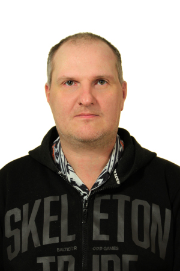

# Andrey Misyura CV
## Download cv:
### [download in docx](https://github.com/amveng/cv/raw/master/andrey_misyura_cv.docx)
### [download in pdf](https://github.com/amveng/cv/raw/master/andrey_misyura_cv.pdf)

----------------------- -------------------------

 

**PERSONAL DATA**
 
  **Name:**            Andrey Misyura

  **Date of Birth:**   12/09/1975

  **Location:**        Russia, Murmansk

  **Mobile:**          +7 960 025 25 65

  **E-mail:**          amveng315\@gmail.com

  **Telegram:**        <https://t.me/AMveng>
   
  -------------------- -----------------------

**OBJECTIVE**

  
  **Desired Position:**     Ruby on rails developer
  -----------------------  -------------------------

**SUMMARY OF QUALIFICATION**

 I'm working with Ruby on Rails framework since May 2020.      
                                                                      
 During this time I\'ve released my project(<https://lineagetop.com/>) 
 application for advertisement game servers with ability for users  to vote   and publish paid ads and banners. For admin users there is possibility to manage advertisements, servers, content on the pages, users, ability to see all payments and votes. Also this application provides access to API for server\'s owners by secret keys                                                           
                                                                       
 My current stack of technologies is: Ruby, Rails, Postgres, Sidekiq,  
 Redis, Docker, git, Rspec, Factory bot, Unicorn, Active admin, sidekiq-scheduler.  

 In my previous experience I was working as System Administrator 5 years                                       
                                                                       
 I have experience with setting up servers (Red Hat, Fedora) for         
 computer club for network optimisation.                              
                                                                       
 I was administrating Russian Championship of cyber-sport of the city.   
                                                                       
 I have experience with writing bots for game industry                                    
                                                                       

**LANGUAGES**

-   English -- Beginner

-   Russian -- Native Speaker

**EDUCATION**

-   1993/ secondary (complete) education

-   PROFESSIONAL EXPERIENCE

 System administration 2001-2006.                 
                                                  
 Development of my own project with ruby on rails 
                                                  
 <https://github.com/amveng/LT_ROR>               

